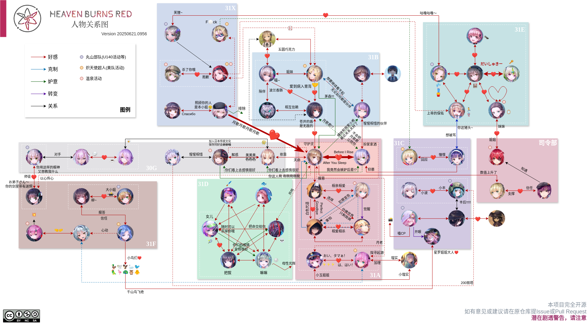

# hbr-relationship

微博 [@叶月云海](https://weibo.com/u/2453349927)

想着既然已经迁到 [draw.io](https://app.diagrams.net/) 框架上，干脆做戏做全套，搞成一个开源项目算了。
目的仅仅是把之前业余时间兴趣使然做着玩的图的编辑权限索性开放给社区+可以有一个比较完整的更新日志和可追溯的编辑记录。

本关系图遵循 CC BY-SA-NC 4.0 协议提供。
角色头像使用了 [hbr.quest](https://hbr.quest) 收集的素材，如侵权请联系作者删除。

## 编辑

将本仓库克隆至本地即可编辑。

可以采用 VSCode 作为编辑器，利用 [Draw.io Integration](https://marketplace.visualstudio.com/items?itemName=hediet.vscode-drawio) 插件进行编辑。

如希望对内容进行补充和修改，欢迎提出 issue 或 PR。
